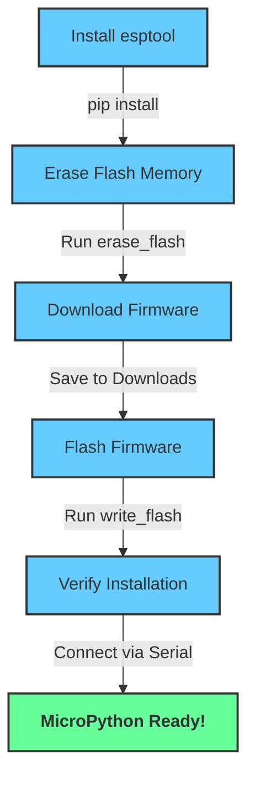

# MicroPython Installation Guide for ESP8266

This guide walks you through installing MicroPython on an ESP8266 microcontroller.

## Prerequisites

Ensure you have the following installed:

- Python 3.x
- `pip` (Python package manager)
- `esptool` (flashing utility for ESP devices)

## Step 1: Install `esptool`

```sh
pip install esptool
```

## Step 2: Erase the Flash Memory

Before flashing MicroPython, erase the existing flash memory on the ESP8266:

```sh
esptool.py --port /dev/ttyUSB0 erase_flash
```

> Replace `/dev/ttyUSB0` with the correct port for your system (e.g., `/dev/tty.usbserial-XXXX` on macOS or `COMx` on Windows).

## Step 3: Download MicroPython Firmware

Download the latest MicroPython firmware for ESP8266 from:

[MicroPython ESP8266 Firmware](https://micropython.org/download/ESP8266_GENERIC/)

Save the firmware file (e.g., `ESP8266_GENERIC-20241129-v1.24.1.bin`) to your `Downloads` folder.

## Step 4: Flash the MicroPython Firmware

Run the following command to write the firmware to the ESP8266:

```sh
esptool.py --port /dev/tty.usbserial-A5069RR4 write_flash --flash_mode dio --flash_size 4MB 0x0 ~/Downloads/ESP8266_GENERIC-20241129-v1.24.1.bin
```

> Update the port and file path according to your system.

## Step 5: Verify Installation

Once flashed, connect to the ESP8266 using a serial terminal (e.g., `screen`, `picocom`, or `minicom`):

```sh
screen /dev/ttyUSB0 115200
```

If the installation was successful, you should see a Python REPL prompt (`>>>`).

## Flowchart



Now your ESP8266 is ready to run MicroPython! 🚀

