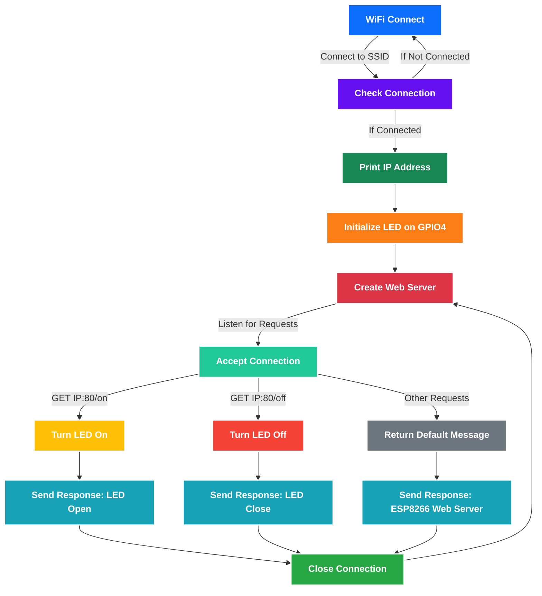

## Flowchart

```mermaid
graph TD;
    A[WiFi Connect] -->|Connect to SSID| B[Check Connection];
    B -->|If Connected| C[Print IP Address];
    B -->|If Not Connected| A;
    C --> D[Initialize LED on GPIO4];
    D --> E[Create Web Server];
    E -->|Listen for Requests| F[Accept Connection];
    F -->|"GET IP:80/on"| G[Turn LED On];
    F -->|"GET IP:80/off"| H[Turn LED Off];
    F -->|Other Requests| I[Return Default Message];
    G --> J[Send Response: LED Open];
    H --> K[Send Response: LED Close];
    I --> L[Send Response: ESP8266 Web Server];
    J --> M[Close Connection];
    K --> M;
    L --> M;
    M --> E;

    style A fill:#0d6efd,stroke:#ffffff,stroke-width:2px,color:#ffffff,font-weight:bold;
    style B fill:#6610f2,stroke:#ffffff,stroke-width:2px,color:#ffffff,font-weight:bold;
    style C fill:#198754,stroke:#ffffff,stroke-width:2px,color:#ffffff,font-weight:bold;
    style D fill:#fd7e14,stroke:#ffffff,stroke-width:2px,color:#ffffff,font-weight:bold;
    style E fill:#dc3545,stroke:#ffffff,stroke-width:2px,color:#ffffff,font-weight:bold;
    style F fill:#20c997,stroke:#ffffff,stroke-width:2px,color:#ffffff,font-weight:bold;
    style G fill:#ffc107,stroke:#ffffff,stroke-width:2px,color:#ffffff,font-weight:bold;
    style H fill:#f44336,stroke:#ffffff,stroke-width:2px,color:#ffffff,font-weight:bold;
    style I fill:#6c757d,stroke:#ffffff,stroke-width:2px,color:#ffffff,font-weight:bold;
    style J fill:#17a2b8,stroke:#ffffff,stroke-width:2px,color:#ffffff,font-weight:bold;
    style K fill:#17a2b8,stroke:#ffffff,stroke-width:2px,color:#ffffff,font-weight:bold;
    style L fill:#17a2b8,stroke:#ffffff,stroke-width:2px,color:#ffffff,font-weight:bold;
    style M fill:#28a745,stroke:#ffffff,stroke-width:2px,color:#ffffff,font-weight:bold;

```

Now your ESP8266 is ready to run MicroPython with a local web server for LED control! 🚀

